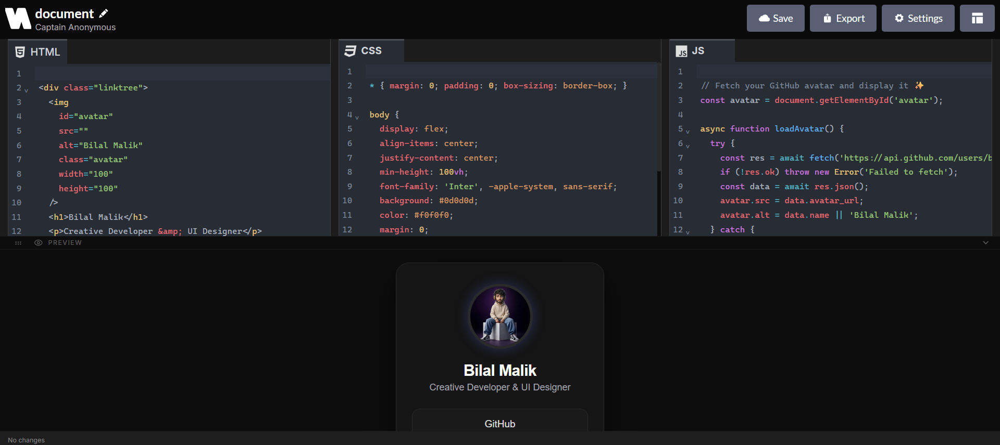

<<<<<<< HEAD
  
=======
  
>>>>>>> b363ae7857cba175d7da858f5419fbef7062c380

<h1 align="center">NetPen</h1>

  <strong>Write. Preview. Export. All in real-time.</strong> 
  A lightweight, zero-setup live code playground for HTML, CSS, and JavaScript.

  
  
  
  
  
  
  
  
  
  
  
  
  

  

  

---

## What is NetPen?

**NetPen** is a free, open-source live coding environment for HTML, CSS, and JavaScript. Write code in three side-by-side editors and see your changes render instantly in the preview pane - no save, no refresh, no setup.

Whether you're prototyping a UI, testing a snippet, teaching someone to code, or building a quick landing page, NetPen gives you a clean, distraction-free workspace to bring your ideas to life.

## Why NetPen?

Online code editors are often bloated, slow, or locked behind paywalls. NetPen is built to be the opposite:

-  **Instant preview** – See your changes as you type.
-  **Clean UI** – No clutter, just the code and the result.
-  **Auto-saved** – Everything stays in your browser's localStorage.
-  **One-click export** – Download separate files, a ZIP, or a single HTML file.

Whether you're a beginner learning the basics or a seasoned developer testing a component, NetPen adapts to your flow, not the other way around.

---

## Features

###  Live Code Editors
Three synchronized editors for HTML, CSS, and JavaScript with syntax highlighting, autocomplete, bracket matching, and line numbers. Powered by CodeMirror 6.

###  Multiple Editor Themes
Switch between One Dark, One Light, VS Code Dark, and Solarized Dark. Pick what feels right for your eyes.

###  3 Layout Modes
- **Default** - Side-by-side editors with a resizable bottom preview
- **Vertical Sidebar** - Editors stacked vertically on the left, preview full-height on the right
- **Split** - 50/50 split with stacked editors on the left, preview on the right

###  Live Preview
See your HTML, CSS, and JS render in real-time. The preview dynamically adapts to the background color of your code.

###  Fullscreen Preview
Click the expand button inside the preview to go fullscreen. Perfect for demos and presentations.

###  Export Panel
- **Separate files** – Download `.html`, `.css`, and `.js` individually
- **Combined HTML** – Export everything in a single `.html` file
- **ZIP archive** – Download all files as a compressed `.zip`
- **Advanced options** – Toggle comments and minify code before export

###  Smart Save Button
The header save button dynamically updates its state:
- `Save` - Idle state
- `Saving...` - When you're typing
- `Changes Saved` - After debounced auto-save to localStorage

###  Editable Project Name
Click the pencil icon next to "Untitled" to rename your project. The name is used for all export file names.

###  Responsive Layout
The UI adapts gracefully across desktop, tablet, and mobile screens. Non-essential buttons hide on smaller viewports.

###  Persistent Storage
All your code, project name, editor theme, font size, tab size, word wrap setting, and even the layout preference are saved to localStorage. Close the tab, come back later -everything is exactly where you left it.

---

## How to Use

| Action | How to do it |
|--------|--------------|
| **Write code** | Click into any editor and start typing |
| **See preview** | Changes appear instantly in the preview pane |
| **Change layout** | Click the grid icon in the header → choose layout |
| **Rename project** | Click the pencil next to the project title |
| **Toggle word wrap** | Open Settings → enable Word Wrap |
| **Change editor theme** | Open Settings → pick a theme |
| **Export project** | Click the Export button in the header |
| **Toggle fullscreen preview** | Click the expand icon inside the preview |
| **Resize default preview** | Drag the handle above the preview area |

---

## Tech Stack

| Technology | Purpose |
|------------|---------|
| **React 19** | UI framework |
| **TypeScript** | Type safety |
| **Tailwind CSS v4** | Styling |
| **Vite 6** | Build tool |
| **CodeMirror 6** | Code editor engine |
| **Lucide React** | Icons |
| **React Icons** | Additional icon sets |
| **JSZip** | ZIP archive generation |

---

## Support

If NetPen helps you, consider supporting the project:

- ⭐ Star this repository on GitHub
-  Share it with your friends and community
-  Leave feedback in GitHub Discussions
-  Buy me a coffee

  

  

---
  

  © 2026 NetPen - Open Source MIT

